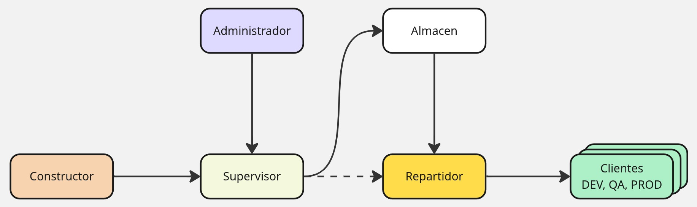

# FastDeploy

## Descripción General
FastDeploy es una herramienta de despliegue automatizado que permite gestionar y distribuir aplicaciones a diferentes entornos (desarrollo, pruebas y producción) de manera eficiente y controlada.

## Arquitectura del Sistema

El sistema está compuesto por los siguientes componentes:

### Administrador
- Gestiona los permisos y configuraciones del sistema
- Controla el acceso a las diferentes funcionalidades
- Supervisa el funcionamiento general de la plataforma

### Constructor
- Responsable de la compilación del código fuente
- Genera los artefactos necesarios para el despliegue
- Verifica la integridad de las construcciones

### Supervisor
- Coordina el proceso de revisión y aprobación de despliegues
- Comunica con el Administrador para aplicar políticas de seguridad
- Gestiona el flujo de trabajo entre el Constructor y el Repartidor

### Almacén
- Repositorio centralizado de artefactos
- Almacena versiones históricas de las aplicaciones
- Mantiene la trazabilidad de los despliegues

### Repartidor
- Distribuye los artefactos a los diferentes entornos
- Gestiona las conexiones con los clientes
- Monitorea el estado de los despliegues

### Clientes
- Entornos de destino: Desarrollo (DEV), Control de Calidad (QA) y Producción (PROD)
- Reciben y ejecutan las actualizaciones
- Reportan el estado del despliegue al sistema central

## Flujo de Trabajo

1. El Constructor prepara los artefactos necesarios
2. El Supervisor recibe y valida estos artefactos
3. El Administrador verifica y autoriza los despliegues
4. El Supervisor envía los artefactos aprobados al Almacén
5. El Repartidor obtiene los artefactos del Almacén
6. El Repartidor distribuye los artefactos a los Clientes según su entorno

## Requisitos del Sistema

*(Por definir según las necesidades específicas del proyecto)*

## Instalación y Configuración

go build -o fd ./cmd/fast

in Mac: ./fd init

*(Por completar con instrucciones de instalación y configuración)*

## Licencia

*(Por definir según las políticas de la organización)*

prueba